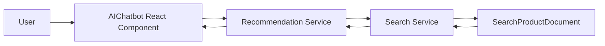

# Chương 3: AI Service cho tư vấn sản phẩm

> Báo cáo này trình bày phần em đã tích hợp AI vào project `ecommerce_ai` theo chỉ mục Chương 3 trong tài liệu tham khảo môn Kiến trúc và Thiết kế Phần mềm.

## 3.1. Mục tiêu

Mục tiêu của phần AI là bổ sung khả năng tư vấn và gợi ý sản phẩm cho hệ thống e-commerce. Trong phạm vi đồ án, em không xây dựng một mô hình học máy lớn ngay từ đầu, mà tích hợp trước một pipeline AI demo có thể chạy được:

- Người dùng nhập nhu cầu mua hàng ở chatbot.
- Frontend gửi câu hỏi đến `recommendation-service`.
- `recommendation-service` gọi `search-service` để truy xuất sản phẩm liên quan.
- Service phân loại intent đơn giản theo nhóm `book`, `electronics`, `fashion`.
- Service trả về câu trả lời tư vấn và danh sách sản phẩm gợi ý.

Phần đã làm giúp project có nền tảng để mở rộng lên LSTM, Knowledge Graph và RAG ở các phiên bản tiếp theo.

## 3.2. Kiến trúc AI Service

AI được đặt trong `recommendation-service`, vì service này đã quản lý hành vi người dùng và danh sách gợi ý sản phẩm.

Các thành phần đã tích hợp:

| Thành phần | File | Vai trò |
| --- | --- | --- |
| AI chatbot endpoint | `services/recommendation_service/recommendations/views.py` | Nhận câu hỏi, gọi Search service, sinh câu trả lời |
| AI serializers | `services/recommendation_service/recommendations/serializers.py` | Validate request/response chatbot |
| AI route | `services/recommendation_service/recommendations/urls.py` | Khai báo `POST /api/v1/ai/chatbot/` |
| Service URL config | `services/shared/ecommerce_common/settings.py` | Thêm URL nội bộ cho Search và Recommendation |
| Frontend chatbot | `frontend/src/components/AIChatbot.tsx` | Giao diện tư vấn sản phẩm |
| API client | `frontend/src/api.ts` | Thêm hàm `askAIAdvisor()` |
| TypeScript types | `frontend/src/types.ts` | Thêm `AIChatResponse`, `AIProductSuggestion` |

Sơ đồ kiến trúc:



Endpoint chính:

```text
POST /api/v1/ai/chatbot/
```

Ví dụ request:

```json
{
  "message": "tôi cần laptop gaming"
}
```

Ví dụ response:

```json
{
  "answer": "Based on your request, I suggest ...",
  "source": "recommendation-service AI demo: query -> search-service retrieval -> heuristic ranking",
  "intent": "electronics",
  "suggestions": [
    {
      "product_id": "...",
      "sku": "LAPTOP-001",
      "name": "Gaming Laptop",
      "product_type": "electronics",
      "brand": "Demo Brand",
      "reason": "Matches requested product type: electronics."
    }
  ]
}
```

## 3.3. Thu thập dữ liệu

Project hiện có hai nguồn dữ liệu chính phục vụ AI:

### 3.3.1. Dữ liệu hành vi người dùng

Model:

```text
ProductInteraction
```

File:

```text
services/recommendation_service/recommendations/models.py
```

Các event được hỗ trợ:

- `viewed`
- `added_to_cart`
- `purchased`
- `wishlisted`

Dữ liệu này là đầu vào phù hợp cho recommendation theo hành vi trong tương lai.

### 3.3.2. Dữ liệu tìm kiếm sản phẩm

Model:

```text
SearchProductDocument
```

File:

```text
services/search_service/search/models.py
```

Read model này lưu các trường:

- `product_id`
- `sku`
- `name`
- `description`
- `product_type`
- `brand`
- `price_amount`
- `available_quantity`
- `rating_average`
- `search_text`

Trong chatbot hiện tại, `recommendation-service` retrieve dữ liệu từ endpoint:

```text
GET /api/v1/products/search/?q=<message>
```

## 3.4. Mô hình LSTM (Sequence Modeling)

Trong phạm vi code hiện tại, em chưa huấn luyện LSTM thật. Tuy nhiên, project đã chuẩn bị dữ liệu hành vi bằng `ProductInteraction`, đây là dữ liệu cần thiết để xây dựng sequence model.

Ý tưởng mở rộng:

```text
customer_id -> [viewed SKU A, added_to_cart SKU B, purchased SKU C] -> predict next SKU
```

Pipeline đề xuất:

1. Lấy lịch sử `ProductInteraction` theo `customer_id`.
2. Sắp xếp theo `created_at`.
3. Mã hóa SKU/event type thành vector.
4. Huấn luyện LSTM để dự đoán sản phẩm tiếp theo.
5. Ghi kết quả vào bảng `recommendations`.

Ví dụ pseudo-code:

```python
sequence = ["SKU-BOOK-1", "SKU-LAPTOP-1", "SKU-MOUSE-1"]
next_product = lstm_model.predict(sequence)
```

## 3.5. Knowledge Graph với Neo4j

Project hiện chưa tích hợp Neo4j thật. Tuy nhiên, dữ liệu hiện tại có thể ánh xạ sang Knowledge Graph như sau:

| Node | Nguồn dữ liệu |
| --- | --- |
| User/Customer | Identity, Customer service |
| Product | Catalog/Search service |
| Category | Catalog service |
| Interaction | Recommendation service |

Quan hệ có thể tạo:

```text
(Customer)-[:VIEWED]->(Product)
(Customer)-[:ADDED_TO_CART]->(Product)
(Customer)-[:PURCHASED]->(Product)
(Product)-[:BELONGS_TO]->(Category)
(Product)-[:SIMILAR_TO]->(Product)
```

Trong phiên bản hiện tại, phần tương đương Knowledge Graph được mô phỏng đơn giản bằng `ProductInteraction` và `Recommendation`.

## 3.6. RAG (Retrieval-Augmented Generation)

RAG gồm hai bước:

1. Retrieve: lấy tài liệu/sản phẩm liên quan.
2. Generate: sinh câu trả lời dựa trên dữ liệu vừa lấy.

Phần đã làm trong project:

| Bước RAG | Cách triển khai |
| --- | --- |
| Retrieve | `recommendation-service` gọi `search-service` |
| Context | Dữ liệu `SearchProductDocument` |
| Generate | Sinh câu trả lời bằng heuristic trong `AIChatbotView` |

Luồng hiện tại:

```text
User message
-> Recommendation service
-> Search service
-> SearchProductDocument
-> Intent matching
-> Answer + suggestions
```

Đây là RAG demo chưa dùng LLM thật, nhưng đã tách đúng trách nhiệm: frontend hiển thị, recommendation xử lý AI, search cung cấp dữ liệu truy xuất.

## 3.7. Kết hợp Hybrid Model

Hybrid model trong thiết kế gồm:

- Search/RAG để hiểu câu hỏi và tìm sản phẩm liên quan.
- Interaction-based recommendation để cá nhân hóa.
- LSTM để dự đoán hành vi tiếp theo.
- Knowledge Graph để khai thác quan hệ sản phẩm.

Trong code hiện tại, công thức hybrid được đơn giản hóa:

```text
final_suggestion = search_result + intent_filter + heuristic_reason
```

Hướng mở rộng:

```text
final_score = 0.4 * search_score + 0.3 * interaction_score + 0.2 * graph_score + 0.1 * business_rule_score
```

## 3.8. Hai dạng AI Service

### 3.8.1. Recommendation List

Project đã có endpoint:

```text
GET /api/v1/recommendations/for-customer/{customer_id}/
```

Endpoint này lấy danh sách sản phẩm gợi ý đã lưu trong bảng `recommendations`.

Frontend dùng hàm:

```typescript
api.listRecommendations(token, customerId)
```

### 3.8.2. Chatbot tư vấn

Project đã bổ sung endpoint:

```text
POST /api/v1/ai/chatbot/
```

Frontend dùng hàm:

```typescript
api.askAIAdvisor(token, message)
```

Component hiển thị:

```text
frontend/src/components/AIChatbot.tsx
```

Chatbot có thể nhận các câu như:

- `laptop gaming`
- `tôi cần sách cho sinh viên`
- `giày thời trang`

## 3.9. Triển khai AI Service

Các file đã chỉnh sửa/thêm:

| File | Nội dung |
| --- | --- |
| `services/recommendation_service/recommendations/views.py` | Thêm `AIChatbotView` |
| `services/recommendation_service/recommendations/serializers.py` | Thêm request/response serializer cho chatbot |
| `services/recommendation_service/recommendations/urls.py` | Thêm route `ai/chatbot/` |
| `services/shared/ecommerce_common/settings.py` | Thêm `search` và `recommendation` vào `SERVICE_URLS` |
| `docker-compose.yml` | Thêm `SEARCH_SERVICE_URL`, `RECOMMENDATION_SERVICE_URL` |
| `frontend/src/api.ts` | Thêm `askAIAdvisor()` |
| `frontend/src/types.ts` | Thêm type AI response |
| `frontend/src/components/AIChatbot.tsx` | Thêm chatbot UI |

Luồng triển khai:

```text
React AIChatbot
-> api.askAIAdvisor()
-> recommendation-service /api/v1/ai/chatbot/
-> search-service /api/v1/products/search/
-> response suggestions
-> render product cards in chatbot
```

## 3.10. Bài tập

Theo yêu cầu thực hành Chương 3, phần đã hoàn thành gồm:

- [x] Tạo API recommendation cơ bản.
- [x] Lưu hành vi người dùng bằng `ProductInteraction`.
- [x] Tạo chatbot tư vấn sản phẩm.
- [x] Kết nối chatbot frontend với backend.
- [x] Áp dụng pipeline RAG demo qua Search service.
- [ ] Huấn luyện LSTM thật.
- [ ] Tạo graph trong Neo4j.
- [ ] Tích hợp vector database.
- [ ] Tích hợp LLM thật.

## 3.11. Checklist đánh giá

| Tiêu chí | Trạng thái | Minh chứng |
| --- | --- | --- |
| Có pipeline AI rõ ràng | Đạt | `AIChatbot -> recommendation-service -> search-service` |
| Có API hoạt động | Đạt | `POST /api/v1/ai/chatbot/` |
| Có recommendation list | Đạt | `GET /api/v1/recommendations/for-customer/{id}/` |
| Có dữ liệu hành vi | Đạt | `ProductInteraction` |
| Có RAG demo | Đạt một phần | Retrieve từ Search, generate bằng heuristic |
| Có model LSTM | Chưa đạt | Mới thiết kế hướng mở rộng |
| Có Graph/Neo4j | Chưa đạt | Mới mô tả mapping |
| Có chatbot frontend | Đạt | `frontend/src/components/AIChatbot.tsx` |

## 3.12. Kết luận

Em đã tích hợp AI ở mức demo thực thi được bằng cách bổ sung chatbot tư vấn sản phẩm vào frontend và endpoint xử lý AI trong `recommendation-service`. Hệ thống hiện có thể nhận câu hỏi người dùng, truy xuất dữ liệu sản phẩm từ `search-service`, phân loại intent cơ bản và trả về danh sách sản phẩm gợi ý.

Phần này chưa phải AI hoàn chỉnh như production, nhưng đã đặt đúng kiến trúc: AI logic nằm ở Recommendation context, dữ liệu truy xuất nằm ở Search context, frontend chỉ đóng vai trò giao diện. Đây là nền tảng để tiếp tục tích hợp LSTM, Knowledge Graph, Vector Database và RAG dùng LLM ở các phiên bản tiếp theo.
