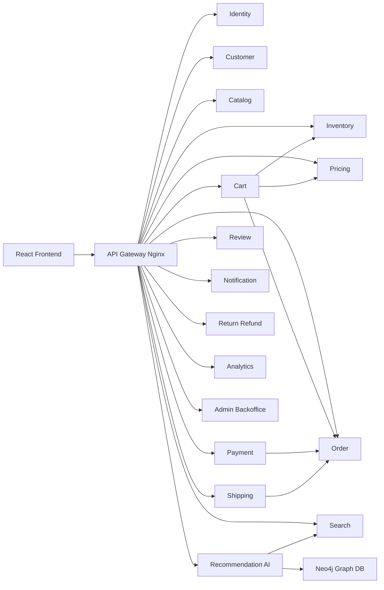
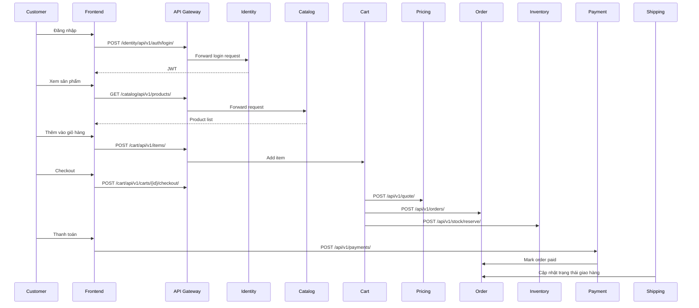
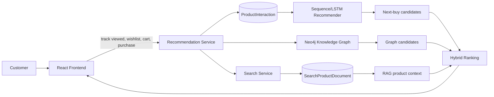
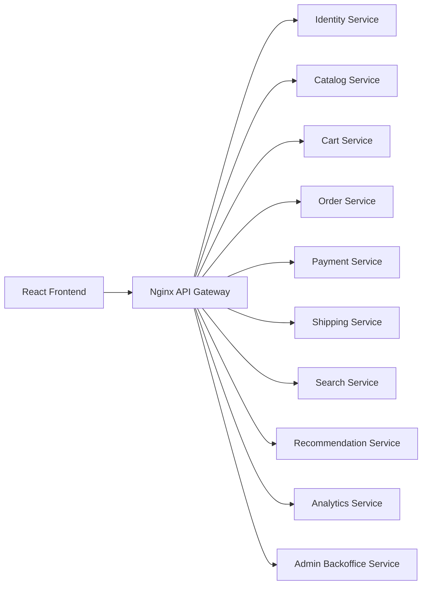
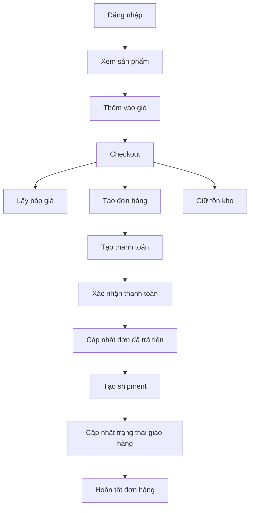

# TIỂU LUẬN MÔN KIẾN TRÚC VÀ THIẾT KẾ PHẦN MỀM

## Chủ đề: Xây dựng hệ thống E-Commerce theo Microservices, DDD và AI Recommendation

**GVHD:** Trần Đình Quế  
**Sinh viên/Nhóm:** ................................................  
**Lớp:** ............................................................  
**Project minh họa:** `ecommerce_ai`  
**Ngày cập nhật:** 12/06/2026

---

## Mục lục

1. Từ Monolithic đến Microservices và DDD  
2. Phân tích và thiết kế hệ thống E-Commerce Microservices  
3. AI Service cho tư vấn và gợi ý sản phẩm  
4. Xây dựng hệ thống hoàn chỉnh bằng Django, React, Docker và Nginx  
5. Đánh giá, hạn chế và hướng phát triển  
6. Kết luận

---

## Chương 1: Từ Monolithic đến Microservices và DDD

### 1.1. Monolithic Architecture

Monolithic Architecture là kiến trúc trong đó toàn bộ hệ thống được xây dựng, đóng gói và triển khai như một khối duy nhất. Với một hệ thống e-commerce đơn giản, các chức năng như quản lý người dùng, quản lý sản phẩm, giỏ hàng, đơn hàng, thanh toán và giao hàng có thể nằm chung trong một project Django và dùng chung một database.

Cấu trúc monolithic thường gồm:

| Lớp | Vai trò |
| --- | --- |
| Presentation Layer | Giao diện người dùng hoặc API |
| Business Logic Layer | Xử lý nghiệp vụ |
| Data Access Layer | Truy vấn và cập nhật database |

Ưu điểm của monolithic là dễ khởi tạo, dễ chạy local và phù hợp với hệ thống nhỏ hoặc MVP. Tuy nhiên, khi hệ thống phát triển, kiến trúc này bộc lộ nhiều hạn chế:

- Khó mở rộng độc lập từng chức năng.
- Một lỗi nhỏ có thể ảnh hưởng toàn bộ hệ thống.
- Nhiều nhóm phát triển dễ xung đột trên cùng codebase.
- Database dùng chung làm tăng coupling giữa các module.
- Deploy toàn bộ hệ thống dù chỉ sửa một phần nhỏ.

### 1.2. Microservices Architecture

Microservices Architecture chia hệ thống thành nhiều dịch vụ nhỏ, mỗi dịch vụ phụ trách một năng lực nghiệp vụ riêng và có thể được triển khai độc lập.

Trong project `ecommerce_ai`, hệ thống không được xây dựng như một Django project duy nhất. Thay vào đó, mỗi bounded context được triển khai thành một Django service riêng như `identity-service`, `catalog-service`, `cart-service`, `order-service`, `payment-service`, `shipping-service`, `recommendation-service`.

Đặc điểm chính:

- Mỗi service có code, migration và database riêng.
- Các service giao tiếp qua REST API.
- Frontend gọi API qua các URL service hoặc qua API Gateway.
- Service này không truy cập trực tiếp database của service khác.
- Dữ liệu liên service được tham chiếu bằng UUID, ví dụ `customer_id`, `product_id`, `order_id`.

So sánh hai kiến trúc:

| Tiêu chí | Monolithic | Microservices |
| --- | --- | --- |
| Triển khai | Một khối duy nhất | Nhiều service độc lập |
| Database | Thường dùng chung | Database-per-service |
| Scale | Scale toàn hệ thống | Scale từng service |
| Coupling | Cao hơn | Thấp hơn |
| Debug local | Dễ hơn | Khó hơn do phân tán |
| Phù hợp | MVP, hệ nhỏ | Hệ lớn, nhiều domain |

### 1.3. Domain Driven Design

Domain Driven Design (DDD) là phương pháp thiết kế phần mềm tập trung vào nghiệp vụ. DDD giúp nhóm phát triển không chia hệ thống theo tầng kỹ thuật như `views`, `services`, `repositories`, mà chia theo miền nghiệp vụ như Catalog, Inventory, Order, Payment.

Các khái niệm chính:

| Khái niệm | Ý nghĩa | Ví dụ trong project |
| --- | --- | --- |
| Entity | Đối tượng có định danh | `Product`, `Order`, `Payment` |
| Value Object | Đối tượng mô tả giá trị, không cần định danh riêng | `shipping_address`, `attributes_snapshot` |
| Aggregate | Nhóm entity có rule nhất quán | `Order` và `OrderLine` |
| Bounded Context | Ranh giới nghiệp vụ rõ ràng | Catalog, Cart, Pricing, Inventory |
| Ubiquitous Language | Ngôn ngữ chung giữa dev và nghiệp vụ | SKU, checkout, reservation, refund |

Trong project này, DDD được thể hiện qua cách tách các service:

- Catalog chỉ quản lý thông tin mô tả sản phẩm.
- Inventory chỉ quản lý tồn kho và giữ hàng.
- Pricing chỉ quản lý giá, coupon và quote.
- Cart điều phối checkout nhưng không tự quyết định giá hoặc tồn kho.
- Order lưu snapshot đơn hàng và quản lý vòng đời trạng thái.
- Payment ghi nhận giao dịch thanh toán.
- Shipping ghi nhận vận chuyển và sự kiện giao hàng.

### 1.4. Vì sao chọn Microservices cho E-Commerce

E-commerce là hệ thống có nhiều nghiệp vụ thay đổi độc lập. Giá bán có thể thay đổi liên tục, tồn kho cần chính xác, thanh toán cần an toàn, giao hàng có vòng đời riêng, tìm kiếm và gợi ý sản phẩm cần tối ưu trải nghiệm. Nếu đặt tất cả vào một hệ monolithic, hệ thống dễ trở nên khó bảo trì.

Microservices phù hợp vì:

- Catalog có thể scale riêng khi nhiều người xem sản phẩm.
- Search có thể dùng read model riêng để tìm kiếm nhanh.
- Payment có thể được bảo vệ và audit chặt hơn.
- Recommendation có thể phát triển AI mà không ảnh hưởng checkout.
- Admin Backoffice có thể phục vụ vận hành nội bộ.

---

## Chương 2: Phát triển hệ E-Commerce Microservices

Chương này trình bày quá trình phân tích và thiết kế hệ thống e-commerce theo kiến trúc microservices dựa trên hướng dẫn môn học trong `guide_tieuluan.md`, đồng thời ánh xạ trực tiếp vào project `ecommerce_ai`. Khác với cách xây dựng một Django monolith, hệ thống được chia thành nhiều bounded context độc lập. Mỗi context có service, database và trách nhiệm nghiệp vụ riêng, giao tiếp với nhau thông qua REST API và được gom lại phía ngoài bằng API Gateway.

### 2.1. Xác định yêu cầu

#### 2.1.1. Functional Requirements

Hệ thống cần đáp ứng các chức năng chính của một nền tảng thương mại điện tử hiện đại:

| Nhóm chức năng | Mô tả trong hệ thống |
| --- | --- |
| Quản lý người dùng | Đăng ký, đăng nhập, phát hành JWT, phân quyền `admin`, `staff`, `customer` |
| Quản lý khách hàng | Hồ sơ khách hàng, địa chỉ giao hàng, danh sách yêu thích |
| Quản lý sản phẩm | Danh mục, sản phẩm, SKU, biến thể, thuộc tính riêng cho book/electronics/fashion |
| Quản lý tồn kho | Kho hàng, số lượng tồn, giữ hàng khi checkout |
| Quản lý giá | Bảng giá, giá theo SKU, coupon, quote giá trước khi tạo đơn |
| Giỏ hàng | Tạo giỏ hàng, thêm/xóa/cập nhật item, checkout |
| Đơn hàng | Tạo order, order line, lịch sử trạng thái |
| Thanh toán | Payment, transaction, đánh dấu thanh toán thành công, refund |
| Giao hàng | Carrier, shipment, delivery event, cập nhật trạng thái vận chuyển |
| Tìm kiếm | Search document phục vụ tìm kiếm sản phẩm |
| Gợi ý sản phẩm | Lưu hành vi người dùng, recommendation score và chatbot tư vấn |
| Đánh giá | Review sản phẩm, duyệt review |
| Thông báo | Notification template và message gửi cho người dùng |
| Trả hàng/hoàn tiền | Return request và refund request |
| Analytics | Sự kiện nghiệp vụ, daily sales metric |
| Admin Backoffice | Work item và audit log phục vụ vận hành |

#### 2.1.2. Non-functional Requirements

Bên cạnh chức năng nghiệp vụ, project cần đáp ứng các yêu cầu phi chức năng sau:

| Yêu cầu | Cách đáp ứng trong project |
| --- | --- |
| Scalability | Mỗi service chạy độc lập, có thể scale riêng theo tải |
| High Availability | Service được container hóa; có thể mở rộng bằng nhiều replica khi triển khai production |
| Security | Sử dụng JWT, role-based access control và shared signing key |
| Maintainability | Code chia theo bounded context, mỗi service có app Django riêng |
| Fault Isolation | Lỗi ở recommendation/search không làm dừng checkout hoặc thanh toán |
| Data Ownership | Mỗi service sở hữu database riêng, không truy cập chéo database |
| Deployability | Docker Compose khởi tạo frontend, gateway, service và database |
| Observability | Các service có endpoint health check, có thể mở rộng logging/monitoring |

### 2.2. Phân rã hệ thống theo DDD

#### 2.2.1. Bounded Context

Theo Domain Driven Design, mỗi nhóm nghiệp vụ được xem là một bounded context. Trong project `ecommerce_ai`, các context chính được phân rã như sau:

| Bounded Context | Service triển khai | Trách nhiệm |
| --- | --- | --- |
| Identity Context | `identity-service` | User, role, authentication, JWT |
| Customer Context | `customer-service` | Customer profile, address, wishlist |
| Catalog Context | `catalog-service` | Category, product, variant |
| Inventory Context | `inventory-service` | Warehouse, stock item, stock reservation |
| Pricing Context | `pricing-service` | Price book, product price, coupon, quote |
| Cart Context | `cart-service` | Cart, cart item, checkout orchestration |
| Order Context | `order-service` | Order, order line, status history |
| Payment Context | `payment-service` | Payment, payment transaction, refund |
| Shipping Context | `shipping-service` | Shipment, carrier, shipment event |
| Search Context | `search-service` | Search product document |
| Recommendation Context | `recommendation-service` | Product interaction, recommendation, AI chatbot |
| Review Context | `review-service` | Product review và duyệt review |
| Notification Context | `notification-service` | Template và notification message |
| Return/Refund Context | `return-refund-service` | Return request, refund request |
| Analytics Context | `analytics-service` | Analytics event, daily sales metric |
| Backoffice Context | `admin-backoffice-service` | Work item, audit log |

#### 2.2.2. Nguyên tắc thiết kế

Việc phân rã tuân theo các nguyên tắc sau:

- Mỗi context quản lý một phần nghiệp vụ rõ ràng và có ngôn ngữ riêng.
- Mỗi service có database riêng, không share schema giữa các service.
- Service giao tiếp thông qua REST API, không gọi trực tiếp model hoặc database của service khác.
- Dữ liệu cần trao đổi giữa service được truyền dưới dạng snapshot, ví dụ `OrderLine` lưu `product_name`, `sku`, `unit_price_snapshot`.
- Các nghiệp vụ dễ bị gọi lặp sử dụng `idempotency_key` để tránh tạo dữ liệu trùng.
- Frontend không gọi trực tiếp service nội bộ khi chạy qua Docker, mà đi qua `api-gateway`.

Sơ đồ context tổng quát:



### 2.3. Thiết kế Product/Catalog Service

Theo guide, Product Service cần quản lý nhiều loại sản phẩm như book, electronics và fashion. Trong project, phần này được triển khai bằng `catalog-service` với app Django `catalog`.

#### 2.3.1. Phân loại sản phẩm

Sản phẩm được gom trong model tổng quát `Product`, sau đó phân biệt bằng trường `product_type` và `attributes`:

| Loại sản phẩm | Ví dụ thuộc tính |
| --- | --- |
| Book | `author`, `publisher`, `isbn` |
| Electronics | `brand`, `warranty`, `model` |
| Fashion | `size`, `color`, `material` |

Cách thiết kế này phù hợp với e-commerce vì catalog thường thay đổi nhanh. Thay vì tạo bảng riêng cho từng loại sản phẩm, project dùng `JSONField attributes` để lưu thuộc tính linh hoạt.

#### 2.3.2. Model tổng quát

Ở mức phân tích, Catalog gồm các lớp chính:

```python
class Category(models.Model):
    name = models.CharField(max_length=120)
    slug = models.SlugField(unique=True)
    parent = models.ForeignKey("self", null=True, blank=True, on_delete=models.SET_NULL)
    is_active = models.BooleanField(default=True)

class Product(models.Model):
    sku = models.CharField(max_length=64, unique=True)
    name = models.CharField(max_length=255)
    product_type = models.CharField(max_length=32)
    status = models.CharField(max_length=32)
    attributes = models.JSONField(default=dict)

class ProductVariant(models.Model):
    product = models.ForeignKey(Product, on_delete=models.CASCADE)
    sku = models.CharField(max_length=64, unique=True)
    attributes = models.JSONField(default=dict)
```

#### 2.3.3. API

Các API catalog được xây dựng bằng Django REST Framework:

```text
GET    /api/v1/categories/
POST   /api/v1/categories/
GET    /api/v1/products/
POST   /api/v1/products/
GET    /api/v1/products/{id}/
PATCH  /api/v1/products/{id}/
DELETE /api/v1/products/{id}/
```

### 2.4. Thiết kế Identity/User Service

#### 2.4.1. Phân loại người dùng

Hệ thống có ba nhóm người dùng:

| Role | Quyền chính |
| --- | --- |
| `admin` | Quản trị toàn bộ hệ thống, tạo catalog, giá, kho, backoffice |
| `staff` | Xử lý đơn hàng, vận chuyển, duyệt review, vận hành hằng ngày |
| `customer` | Xem sản phẩm, quản lý profile, mua hàng, theo dõi đơn |

#### 2.4.2. Model và JWT

Identity service chịu trách nhiệm đăng ký, đăng nhập và phát hành JWT. Token chứa các claims cần thiết để các service khác kiểm tra quyền mà không cần truy cập database user:

```json
{
  "user_id": "...",
  "email": "customer@example.com",
  "role": "customer",
  "full_name": "Demo Customer"
}
```

#### 2.4.3. Phân quyền RBAC

Các service dùng permission class chung để kiểm tra vai trò:

- API public như tìm kiếm, xem sản phẩm cho phép anonymous access.
- API tạo/sửa catalog, giá, kho yêu cầu `staff` hoặc `admin`.
- API quản trị toàn hệ thống chỉ cho phép `admin`.
- Customer chỉ thao tác trên dữ liệu của chính mình như cart, profile, order.

#### 2.4.4. API

```text
POST /api/v1/auth/register/
POST /api/v1/auth/login/
GET  /api/v1/users/
GET  /api/v1/users/me/
```

### 2.5. Thiết kế Cart Service

Cart Service quản lý giỏ hàng và là điểm bắt đầu của luồng checkout. Service này không sở hữu dữ liệu sản phẩm hay giá, mà lưu snapshot cần thiết để hiển thị giỏ hàng.

#### 2.5.1. Model

```python
class Cart(models.Model):
    customer_id = models.UUIDField()
    status = models.CharField(max_length=32)

class CartItem(models.Model):
    cart = models.ForeignKey(Cart, on_delete=models.CASCADE)
    product_id = models.UUIDField()
    sku = models.CharField(max_length=64)
    product_name = models.CharField(max_length=255)
    quantity = models.PositiveIntegerField()
    unit_price_snapshot = models.DecimalField(max_digits=12, decimal_places=2)
```

#### 2.5.2. Logic

Cart Service xử lý các nghiệp vụ:

- Tạo cart active cho customer.
- Thêm sản phẩm vào cart.
- Cập nhật số lượng hoặc xóa item.
- Gọi Pricing Service để tính quote.
- Gọi Order Service để tạo đơn.
- Gọi Inventory Service để giữ hàng.
- Chuyển cart sang trạng thái `checked_out`.

#### 2.5.3. API

```text
GET    /api/v1/carts/
POST   /api/v1/carts/
POST   /api/v1/items/
PATCH  /api/v1/items/{id}/
DELETE /api/v1/items/{id}/
POST   /api/v1/carts/{id}/checkout/
```

### 2.6. Thiết kế Order Service

#### 2.6.1. Model

```python
class Order(models.Model):
    customer_id = models.UUIDField()
    status = models.CharField(max_length=32)
    subtotal = models.DecimalField(max_digits=12, decimal_places=2)
    discount_total = models.DecimalField(max_digits=12, decimal_places=2)
    grand_total = models.DecimalField(max_digits=12, decimal_places=2)
    idempotency_key = models.CharField(max_length=128, unique=True)

class OrderLine(models.Model):
    order = models.ForeignKey(Order, on_delete=models.CASCADE)
    product_id = models.UUIDField()
    sku = models.CharField(max_length=64)
    product_name = models.CharField(max_length=255)
    quantity = models.PositiveIntegerField()
    unit_price = models.DecimalField(max_digits=12, decimal_places=2)

class OrderStatusHistory(models.Model):
    order = models.ForeignKey(Order, on_delete=models.CASCADE)
    from_status = models.CharField(max_length=32, blank=True)
    to_status = models.CharField(max_length=32)
```

#### 2.6.2. Workflow

Luồng tạo đơn hàng:

1. Cart Service gửi thông tin cart và quote sang Order Service.
2. Order Service tạo `Order` và `OrderLine` theo snapshot.
3. Order ở trạng thái `pending_payment`.
4. Payment Service xử lý thanh toán.
5. Khi thanh toán thành công, Order được chuyển sang `paid`.
6. Staff tiếp tục xác nhận, giao hàng và hoàn tất đơn.

### 2.7. Thiết kế Payment Service

#### 2.7.1. Model

```python
class Payment(models.Model):
    order_id = models.UUIDField()
    customer_id = models.UUIDField()
    amount = models.DecimalField(max_digits=12, decimal_places=2)
    currency = models.CharField(max_length=8)
    status = models.CharField(max_length=32)
    idempotency_key = models.CharField(max_length=128, unique=True)

class PaymentTransaction(models.Model):
    payment = models.ForeignKey(Payment, on_delete=models.CASCADE)
    provider = models.CharField(max_length=64)
    provider_transaction_id = models.CharField(max_length=128)
    status = models.CharField(max_length=32)
```

#### 2.7.2. Trạng thái

Payment có các trạng thái chính:

- `pending`
- `succeeded`
- `failed`
- `refunded`

#### 2.7.3. API

```text
POST /api/v1/payments/
POST /api/v1/payments/{id}/mark-succeeded/
POST /api/v1/refunds/
GET  /api/v1/payments/
```

### 2.8. Thiết kế Shipping Service

#### 2.8.1. Model

```python
class Carrier(models.Model):
    code = models.CharField(max_length=32, unique=True)
    name = models.CharField(max_length=120)

class Shipment(models.Model):
    order_id = models.UUIDField()
    carrier = models.ForeignKey(Carrier, on_delete=models.SET_NULL, null=True)
    status = models.CharField(max_length=32)
    tracking_number = models.CharField(max_length=128, blank=True)

class ShipmentEvent(models.Model):
    shipment = models.ForeignKey(Shipment, on_delete=models.CASCADE)
    status = models.CharField(max_length=32)
    location = models.CharField(max_length=255, blank=True)
```

#### 2.8.2. Trạng thái

Shipping Service quản lý trạng thái vận chuyển:

- `created`
- `in_transit`
- `delivered`
- `failed`

#### 2.8.3. API

```text
POST /api/v1/shipments/
POST /api/v1/shipments/{id}/update-status/
GET  /api/v1/shipments/
GET  /api/v1/carriers/
```

### 2.9. Luồng hệ thống tổng thể

Luồng mua hàng end-to-end:



Giải thích:

1. Customer đăng nhập và nhận JWT.
2. Frontend dùng JWT để gọi các API cần xác thực.
3. Customer xem catalog, tìm kiếm sản phẩm và thêm vào cart.
4. Khi checkout, Cart Service phối hợp Pricing, Order và Inventory.
5. Payment Service ghi nhận giao dịch thanh toán.
6. Shipping Service theo dõi quá trình giao hàng.
7. Recommendation/Search có thể bổ trợ trải nghiệm tìm kiếm và gợi ý nhưng không chặn luồng mua hàng chính.

### 2.10. Mapping Class Diagram sang Database

#### 2.10.1. Nguyên tắc mapping

Theo guide, việc mapping từ class diagram sang database tuân theo quy tắc:

- Class trong UML trở thành table trong database.
- Attribute trở thành column.
- Association một-nhiều trở thành foreign key.
- Composition như `Order` chứa `OrderLine` được ánh xạ bằng khóa ngoại từ `order_lines` đến `orders`.
- Với microservices, quan hệ giữa service không dùng foreign key database chéo, mà dùng identifier dạng UUID và snapshot.

#### 2.10.2. Mapping một số service chính

Catalog Service:

| Class | Table | Ghi chú |
| --- | --- | --- |
| `Category` | `categories` | Danh mục cha/con |
| `Product` | `products` | Sản phẩm chính, có `sku`, `product_type`, `attributes` |
| `ProductVariant` | `product_variants` | Biến thể theo SKU |

Customer Service:

| Class | Table | Ghi chú |
| --- | --- | --- |
| `CustomerProfile` | `customer_profiles` | Hồ sơ khách hàng |
| `Address` | `addresses` | Địa chỉ giao hàng |
| `WishlistItem` | `wishlist_items` | Sản phẩm yêu thích |

Order Service:

| Class | Table | Ghi chú |
| --- | --- | --- |
| `Order` | `orders` | Đơn hàng chính |
| `OrderLine` | `order_lines` | Dòng hàng trong đơn |
| `OrderStatusHistory` | `order_status_history` | Lịch sử trạng thái |

Inventory Service:

| Class | Table | Ghi chú |
| --- | --- | --- |
| `Warehouse` | `warehouses` | Kho hàng |
| `StockItem` | `stock_items` | Tồn kho theo SKU |
| `StockReservation` | `stock_reservations` | Số lượng giữ cho order |

Recommendation Service:

| Class | Table | Ghi chú |
| --- | --- | --- |
| `ProductInteraction` | `product_interactions` | Hành vi view/add_to_cart/purchase/wishlist |
| `Recommendation` | `recommendations` | Điểm gợi ý theo customer và product |

#### 2.10.3. Database cho từng service

Project dùng PostgreSQL cho toàn bộ service để thống nhất môi trường Docker Compose và tận dụng khả năng lưu JSON tốt của PostgreSQL.

| Service | Database |
| --- | --- |
| `identity-service` | `identity_db` |
| `customer-service` | `customer_db` |
| `catalog-service` | `catalog_db` |
| `inventory-service` | `inventory_db` |
| `pricing-service` | `pricing_db` |
| `cart-service` | `cart_db` |
| `order-service` | `order_db` |
| `payment-service` | `payment_db` |
| `shipping-service` | `shipping_db` |
| `search-service` | `search_db` |
| `recommendation-service` | `recommendation_db` |
| `review-service` | `review_db` |
| `notification-service` | `notification_db` |
| `return-refund-service` | `return_refund_db` |
| `analytics-service` | `analytics_db` |
| `admin-backoffice-service` | `admin_backoffice_db` |

So với ví dụ trong guide có thể dùng cả MySQL và PostgreSQL, project chọn PostgreSQL nhất quán để giảm độ phức tạp khi triển khai local. Về mặt kiến trúc microservices, mỗi service vẫn sở hữu database riêng nên không vi phạm nguyên tắc data ownership.

### 2.11. Thiết kế API Gateway và giao tiếp service

API Gateway dùng Nginx làm reverse proxy. Frontend chỉ cần biết một cổng gateway, còn gateway định tuyến request đến service tương ứng:

| Public path | Service nội bộ |
| --- | --- |
| `/identity` | `identity-service:8000` |
| `/customer` | `customer-service:8000` |
| `/catalog` | `catalog-service:8000` |
| `/inventory` | `inventory-service:8000` |
| `/pricing` | `pricing-service:8000` |
| `/cart` | `cart-service:8000` |
| `/order` | `order-service:8000` |
| `/payment` | `payment-service:8000` |
| `/shipping` | `shipping-service:8000` |
| `/search` | `search-service:8000` |
| `/recommendation` | `recommendation-service:8000` |

Các service gọi nhau thông qua HTTP client chung trong package `ecommerce_common`. Ví dụ Cart Service gọi Pricing Service để lấy quote, sau đó gọi Order Service để tạo đơn và Inventory Service để giữ hàng.

### 2.12. Idempotency và Transaction

Trong môi trường phân tán, request có thể bị retry do timeout hoặc lỗi mạng. Vì vậy một số nghiệp vụ sử dụng `idempotency_key`:

- Tạo order.
- Tạo payment.
- Tạo refund.
- Giữ tồn kho.
- Tạo return request.

Inventory Service cần tránh overselling khi nhiều customer cùng mua một SKU. Vì vậy service dùng transaction và row lock:

```python
with transaction.atomic():
    queryset = StockItem.objects.select_for_update().filter(sku=data["sku"])
```

`transaction.atomic()` bảo đảm một nhóm thao tác database được commit hoặc rollback cùng nhau. `select_for_update()` khóa các dòng tồn kho liên quan trong lúc giữ hàng, giúp số lượng khả dụng không bị trừ sai khi có nhiều checkout đồng thời.

### 2.13. Checklist đánh giá Chương 2

Đối chiếu với checklist trong guide, project đáp ứng các điểm chính:

| Tiêu chí | Trạng thái |
| --- | --- |
| Có phân tích functional requirements | Đã có |
| Có phân tích non-functional requirements | Đã có |
| Có bounded context theo DDD | Đã có |
| Có service riêng cho từng domain | Đã có |
| Có database riêng cho từng service | Đã có |
| Có mapping class sang database | Đã có |
| Có API cho các service chính | Đã có |
| Có luồng nghiệp vụ tổng thể | Đã có |
| Có authentication và RBAC | Đã có |
| Có thiết kế hỗ trợ search/recommendation | Đã có |

### 2.14. Kết luận chương

Chương 2 đã phân tích và thiết kế hệ thống e-commerce theo đúng định hướng của guide: bắt đầu từ yêu cầu chức năng, yêu cầu phi chức năng, phân rã DDD, thiết kế từng service, mapping class diagram sang database và mô tả luồng nghiệp vụ tổng thể. Project `ecommerce_ai` mở rộng ví dụ cơ bản trong guide bằng cách tách thêm nhiều bounded context thực tế như Inventory, Pricing, Search, Recommendation, Review, Notification, Return/Refund, Analytics và Admin Backoffice.

Việc áp dụng microservices giúp hệ thống dễ mở rộng, dễ bảo trì và phù hợp với bài toán e-commerce có nhiều nghiệp vụ thay đổi độc lập. Đồng thời, phần Search và Recommendation tạo nền tảng để Chương 3 tiếp tục trình bày AI Service cho tư vấn và gợi ý sản phẩm.

---

## Chương 3: AI Service cho tư vấn và gợi ý sản phẩm

### 3.1. Mục tiêu AI trong hệ thống

Mục tiêu của Chương 3 là xây dựng một AI Recommendation Service có thể dự đoán sản phẩm mà người dùng có khả năng mua tiếp theo, đồng thời hỗ trợ chatbot tư vấn sản phẩm bằng dữ liệu catalog. Phần AI được thiết kế theo hướng hybrid, nghĩa là không phụ thuộc vào một kỹ thuật duy nhất mà kết hợp nhiều nguồn tín hiệu:

- Hành vi tuần tự của người dùng: `viewed`, `wishlisted`, `added_to_cart`, `purchased`.
- Mô hình sequence/LSTM để dự đoán sản phẩm tiếp theo.
- Knowledge Graph Neo4j để khai thác quan hệ Customer - Product - Product.
- RAG qua `search-service` để lấy thông tin sản phẩm làm ngữ cảnh tư vấn.
- Gemma 4 qua Gemini API, nếu có API key, để sinh câu trả lời tự nhiên bằng tiếng Việt.

Kết quả đầu ra chính của AI service là danh sách sản phẩm được dự đoán là người dùng có khả năng mua, kèm điểm số, nguồn gợi ý và lý do.

### 3.2. Thiết kế AI/Recommendation Context

Trong project `ecommerce_ai`, AI được đặt trong `recommendation-service` vì service này sở hữu dữ liệu hành vi người dùng và bảng gợi ý sản phẩm. `search-service` giữ vai trò read model cho thông tin sản phẩm, còn Neo4j lưu quan hệ graph để hỗ trợ gợi ý theo similarity. Frontend chỉ ghi nhận hành vi và hiển thị kết quả, không tự tính toán recommendation.

Các thành phần đã triển khai:

| Thành phần | File chính | Vai trò |
| --- | --- | --- |
| `ProductInteraction` | `services/recommendation_service/recommendations/models.py` | Lưu chuỗi hành vi người dùng theo customer, product, SKU và event type |
| `Recommendation` | `services/recommendation_service/recommendations/models.py` | Lưu gợi ý đã tính cho từng customer |
| `UserBehaviorLSTMRecommender` | `services/recommendation_service/recommendations/sequence_model.py` | Huấn luyện và dự đoán next-buy bằng LSTM hoặc sequence fallback |
| `Neo4jRecommender` | `services/recommendation_service/recommendations/graph.py` | Seed graph và truy vấn sản phẩm liên quan từ Neo4j |
| `AIChatbotView` | `services/recommendation_service/recommendations/views.py` | Nhận câu hỏi, retrieve sản phẩm, kết hợp graph/LSTM và gọi Gemma nếu cấu hình |
| `NextBuyRecommendationView` | `services/recommendation_service/recommendations/views.py` | Trả về danh sách sản phẩm dự đoán người dùng sẽ mua |
| `SearchProductDocument` | `services/search_service/search/models.py` | Read model cho RAG và enrich thông tin sản phẩm |
| `AIChatbot` | `frontend/src/components/AIChatbot.tsx` | Widget tư vấn sản phẩm |
| Customer dashboard | `frontend/src/App.tsx` | Ghi nhận hành vi và hiển thị khối `AI Next Buy` |

Sơ đồ pipeline AI hiện tại:



Các endpoint chính:

```text
POST /api/v1/ai/chatbot/
GET  /api/v1/recommendations/next-buy/{customer_id}/?limit=10
GET  /api/v1/recommendations/for-customer/{customer_id}/
POST /api/v1/graph/seed/
GET  /api/v1/graph/recommendations/{customer_id}/
```

### 3.3. Thu thập dữ liệu hành vi người dùng

Dữ liệu đầu vào quan trọng nhất của recommender là bảng `ProductInteraction`. Mỗi record biểu diễn một sự kiện người dùng tương tác với sản phẩm:

| Trường | Ý nghĩa |
| --- | --- |
| `customer_id` | Khách hàng tạo hành vi |
| `product_id` | Sản phẩm được tương tác |
| `sku` | Mã SKU dùng để tạo chuỗi hành vi |
| `event_type` | `viewed`, `wishlisted`, `added_to_cart`, `purchased` |
| `metadata` | Dữ liệu bổ sung như source, quantity |
| `created_at` | Thời điểm tạo event, dùng để sắp xếp sequence |

Frontend đã ghi nhận các event chính:

| Event | Vị trí ghi nhận |
| --- | --- |
| `viewed` | Khi người dùng mở trang chi tiết sản phẩm |
| `wishlisted` | Khi người dùng thêm sản phẩm vào wishlist |
| `added_to_cart` | Khi người dùng thêm sản phẩm vào giỏ |
| `purchased` | Sau khi checkout thành công |

Nhờ vậy, chuỗi hành vi của một customer có thể được biểu diễn như sau:

```text
viewed:OPPO-RENO12
-> wishlisted:XIAOMI-14T
-> added_to_cart:SAMSUNG-S24U
-> purchased:SAMSUNG-S24U
-> predict next SKU
```

### 3.4. Mô hình LSTM và sequence fallback

Lớp `UserBehaviorLSTMRecommender` chịu trách nhiệm đọc dữ liệu `ProductInteraction`, tạo chuỗi SKU theo từng customer và dự đoán sản phẩm tiếp theo. Thiết kế này có hai chế độ:

| Chế độ | Điều kiện | Cách hoạt động |
| --- | --- | --- |
| `tensorflow_lstm` | Có cài TensorFlow | Train Keras LSTM và lưu model `.keras` |
| `sequence_fallback` | Chưa cài TensorFlow hoặc dữ liệu chưa đủ | Dùng thống kê chuyển tiếp hành vi để vẫn trả được gợi ý |

Cách tiếp cận này giúp project vẫn chạy nhẹ trong Docker mặc định, nhưng vẫn có đường nâng cấp lên LSTM thật khi cài thêm `requirements-ml.txt`.

Lệnh train:

```bash
docker compose exec recommendation-service python manage.py train_lstm_recommender --epochs 12 --sequence-length 6
```

Artifact được lưu tại:

```text
/app/recommendations/artifacts/user_behavior_lstm.json
/app/recommendations/artifacts/user_behavior_lstm.keras
```

Trong môi trường Docker hiện tại, TensorFlow chưa được cài mặc định để tránh làm nặng toàn bộ Django image. Vì vậy lệnh train tạo `sequence_fallback` artifact. Khi cài thêm TensorFlow, cùng một command sẽ train và lưu Keras LSTM.

Luồng dự đoán next-buy:

```text
ProductInteraction
-> group by customer_id
-> sort by created_at
-> encode SKU sequence
-> LSTM/fallback scoring
-> merge with graph score
-> enrich product facts from Search service
-> return predicted products
```

### 3.5. Knowledge Graph với Neo4j

Neo4j được dùng để biểu diễn quan hệ giữa khách hàng, sản phẩm và sản phẩm tương tự. Graph recommender được triển khai trong `recommendations/graph.py`.

Các node chính:

| Node | Thuộc tính |
| --- | --- |
| `Customer` | `customer_id`, `email`, `full_name`, `segment` |
| `Product` | `product_id`, `sku`, `name`, `product_type`, `brand`, `price`, `search_text` |

Các quan hệ chính:

```text
(Customer)-[:VIEWED]->(Product)
(Customer)-[:WISHLISTED]->(Product)
(Customer)-[:ADDED_TO_CART]->(Product)
(Customer)-[:PURCHASED]->(Product)
(Product)-[:SIMILAR]->(Product)
```

Endpoint seed graph:

```text
POST /api/v1/graph/seed/
```

Endpoint lấy gợi ý từ graph:

```text
GET /api/v1/graph/recommendations/{customer_id}/
```

Graph recommendation hoạt động theo nguyên tắc: lấy các sản phẩm khách đã tương tác, đi theo cạnh `SIMILAR`, sau đó loại các sản phẩm khách đã tương tác trực tiếp. Điểm graph được tính từ trọng số hành vi và điểm tương đồng sản phẩm.

### 3.6. RAG cho chatbot tư vấn sản phẩm

RAG trong project được triển khai theo hướng phù hợp với microservices: `recommendation-service` không đọc trực tiếp database catalog, mà gọi `search-service` để retrieve `SearchProductDocument`.

Các bước RAG:

| Bước | Cách triển khai |
| --- | --- |
| Retrieve sản phẩm | Gọi `GET /api/v1/products/search/?q=<message>` |
| Lọc intent | Phân loại `book`, `electronics`, `fashion` từ câu hỏi |
| Bổ sung ngữ cảnh cá nhân | Lấy `ProductInteraction`, LSTM next-buy candidates và Neo4j graph candidates |
| Generate | Gọi Gemma 4 nếu có `GEMMA_API_KEY`, nếu không dùng câu trả lời fallback |

Luồng chatbot:

```text
User message
-> AIChatbot frontend
-> POST /api/v1/ai/chatbot/
-> Search service retrieve product documents
-> Add Neo4j graph candidates
-> Add LSTM/sequence next-buy candidates
-> Build RAG user context
-> Gemma 4 generate advice or local fallback
-> Return answer + product suggestions
```

Như vậy, chatbot không chỉ trả lời theo keyword, mà còn có thể dùng lịch sử hành vi và graph để cá nhân hóa danh sách sản phẩm gợi ý.

### 3.7. Hybrid ranking cho sản phẩm dự đoán sẽ mua

Endpoint `next-buy` là phần thể hiện rõ nhất mục tiêu “recommender predict users gonna buy it”.

```text
GET /api/v1/recommendations/next-buy/{customer_id}/?limit=10
```

Tham số tùy chọn:

| Query param | Ý nghĩa |
| --- | --- |
| `limit` | Số sản phẩm trả về, mặc định 10 |
| `exclude_purchased` | Loại sản phẩm đã mua, mặc định `true` |
| `persist` | Nếu `true`, lưu kết quả vào bảng `recommendations` |

Cách kết hợp điểm:

```text
final_score = 0.65 * sequence_score + 0.35 * graph_score
```

Sau khi tính điểm, service gọi `search-service` để enrich kết quả bằng `name`, `brand`, `product_type`. Response có dạng:

```json
{
  "customer_id": "...",
  "source": "user-behavior LSTM/fallback + Neo4j knowledge graph + search-service RAG product retrieval",
  "model": {
    "model_source": "sequence_fallback",
    "sequence_length": 6,
    "tensorflow_available": false,
    "trained_at": "..."
  },
  "recommendations": [
    {
      "product_id": "...",
      "sku": "VIVO-V30",
      "name": "Vivo V30 5G 256GB",
      "product_type": "electronics",
      "brand": "Vivo",
      "score": 0.718666,
      "source": "sequence_fallback + neo4j_kg",
      "reason": "Sequence fallback predicts SKU VIVO-V30 from recent behavior transitions..."
    }
  ]
}
```

### 3.8. Chatbot tư vấn sản phẩm

Component `frontend/src/components/AIChatbot.tsx` cho phép người dùng hỏi nhu cầu như:

```text
tôi cần laptop gaming
tôi cần sách về kiến trúc phần mềm
gợi ý giày thời trang
```

Chatbot gọi:

```text
POST /api/v1/ai/chatbot/
```

Endpoint này xử lý theo các bước:

1. Validate `message` và `customer_id`.
2. Phân loại intent.
3. Retrieve sản phẩm từ `search-service`.
4. Lấy graph suggestions từ Neo4j.
5. Lấy sequence suggestions từ `UserBehaviorLSTMRecommender`.
6. Gộp danh sách ứng viên, tránh trùng SKU.
7. Tạo RAG user context.
8. Gọi Gemma 4 nếu có API key, nếu không trả lời bằng fallback.

Điểm quan trọng là chatbot và API next-buy dùng chung dữ liệu hành vi, graph và search document. Điều này làm cho hệ thống nhất quán: người dùng vừa có thể xem khối “AI Next Buy” trên dashboard, vừa có thể hỏi chatbot để được tư vấn.

### 3.9. Tích hợp frontend

Frontend đã được cập nhật để vừa thu thập hành vi, vừa hiển thị kết quả AI.

Các điểm tích hợp chính:

| File | Nội dung |
| --- | --- |
| `frontend/src/api.ts` | Thêm `nextBuyRecommendations()` và dùng `trackInteraction()` |
| `frontend/src/types.ts` | Thêm `NextBuyRecommendation`, `NextBuyRecommendationResponse`, mở rộng `AIProductSuggestion` |
| `frontend/src/App.tsx` | Ghi event sản phẩm và hiển thị panel `AI Next Buy` |
| `frontend/src/components/AIChatbot.tsx` | Gọi `askAIAdvisor()` để nhận câu trả lời và suggestions |

Panel `AI Next Buy` trong customer dashboard hiển thị:

- Tên sản phẩm được dự đoán.
- SKU.
- Product type.
- Score.
- Nguồn gợi ý, ví dụ `sequence_fallback + neo4j_kg`.

### 3.10. Triển khai và kiểm thử

Các file backend đã thêm hoặc chỉnh sửa:

| File | Nội dung |
| --- | --- |
| `services/recommendation_service/recommendations/sequence_model.py` | Mô hình sequence/LSTM recommender |
| `services/recommendation_service/recommendations/management/commands/train_lstm_recommender.py` | Command train model |
| `services/recommendation_service/recommendations/views.py` | Thêm `NextBuyRecommendationView`, tích hợp LSTM vào chatbot và RAG context |
| `services/recommendation_service/recommendations/urls.py` | Thêm route `recommendations/next-buy/<uuid:customer_id>/` |
| `services/recommendation_service/config/settings.py` | Thêm cấu hình `LSTM_RECOMMENDER` |
| `services/search_service/search/views.py` | Cho phép retrieve product document theo SKU |
| `docker-compose.yml` | Thêm biến môi trường LSTM cho recommendation service |
| `requirements-ml.txt` | Khai báo TensorFlow như dependency tùy chọn |

Các bước kiểm thử đã thực hiện:

```text
python -m py_compile ...
docker compose config --quiet
docker compose up -d --build recommendation-service search-service frontend
docker compose exec recommendation-service python manage.py check
docker compose exec search-service python manage.py check
docker compose exec recommendation-service python manage.py train_lstm_recommender --epochs 1 --sequence-length 6
```

Kết quả smoke test qua API Gateway cho thấy endpoint `next-buy` trả về danh sách sản phẩm dự đoán, có score, source và reason. Ví dụ output gồm các SKU như `VIVO-V30`, `XIAOMI-14T`, `OPPO-RENO12`, được kết hợp từ `sequence_fallback` và `neo4j_kg`.

### 3.11. Checklist đánh giá Chương 3

| Tiêu chí | Trạng thái | Minh chứng |
| --- | --- | --- |
| Có dữ liệu hành vi người dùng | Đạt | `ProductInteraction` và frontend event tracking |
| Có API recommendation cơ bản | Đạt | `GET /api/v1/recommendations/for-customer/{id}/` |
| Có API dự đoán sản phẩm sẽ mua | Đạt | `GET /api/v1/recommendations/next-buy/{customer_id}/` |
| Có sequence/LSTM recommender | Đạt một phần | Có LSTM path tùy chọn và fallback chạy được trong Docker mặc định |
| Có Knowledge Graph Neo4j | Đạt | `Neo4jRecommender`, graph seed và graph recommendation endpoint |
| Có RAG cho chatbot | Đạt | Retrieve từ `search-service`, build context từ search, behavior, graph và sequence |
| Có LLM integration | Đạt một phần | Gemma 4 hoạt động khi cấu hình `GEMMA_API_KEY`, có fallback khi chưa cấu hình |
| Có frontend hiển thị kết quả AI | Đạt | `AIChatbot` và panel `AI Next Buy` |
| Có tài liệu triển khai | Đạt | `docs/lstm-rag-kg-recommender.md` |

### 3.12. Hạn chế và hướng phát triển

Phần AI hiện tại đã có pipeline thực thi được, nhưng vẫn còn một số điểm có thể nâng cấp:

- Docker mặc định chưa cài TensorFlow, nên môi trường hiện tại dùng `sequence_fallback`; để train LSTM thật cần cài `requirements-ml.txt` hoặc tạo image riêng cho AI.
- Chưa có vector database như FAISS, Chroma hoặc pgvector để semantic search nâng cao.
- Chưa train graph embedding nâng cao trên Neo4j.
- Chưa có evaluation offline như precision@k, recall@k, hit rate hoặc A/B testing.
- Chưa có model registry/versioning cho artifact LSTM.

Hướng phát triển tiếp theo là tách AI runtime thành service chuyên biệt nếu cần scale ML độc lập, bổ sung vector search cho RAG, đánh giá chất lượng recommendation bằng metric, và tự động train lại model theo lịch.

### 3.13. Kết luận chương

Chương 3 đã triển khai AI Recommendation ở mức có thể chạy trong hệ thống microservices. `recommendation-service` không chỉ lưu recommendation tĩnh, mà đã có khả năng đọc chuỗi hành vi người dùng, dự đoán sản phẩm có khả năng mua tiếp theo, kết hợp Neo4j Knowledge Graph và retrieve thông tin sản phẩm từ `search-service` để tạo ngữ cảnh RAG cho chatbot.

Cách thiết kế này phù hợp với kiến trúc microservices và DDD: Recommendation Context sở hữu logic AI, Search Context cung cấp read model sản phẩm, frontend chỉ ghi nhận hành vi và hiển thị kết quả. Nhờ đó, phần AI có thể tiếp tục phát triển độc lập mà không ảnh hưởng trực tiếp đến luồng checkout, payment hoặc shipping.

---

## Chương 4: Xây dựng hệ thống hoàn chỉnh

### 4.1. Công nghệ sử dụng

| Nhóm | Công nghệ | Vai trò |
| --- | --- | --- |
| Backend | Python, Django 5 | Xây dựng các microservice |
| API | Django REST Framework | REST API, serializer, viewset |
| Xác thực | SimpleJWT, PyJWT | Đăng nhập và xác thực JWT |
| Cơ sở dữ liệu | PostgreSQL 16 | Mỗi service sở hữu một database riêng |
| Frontend | React 18, TypeScript, Vite | Giao diện người dùng |
| Gateway | Nginx | Reverse proxy và định tuyến request |
| Container | Docker, Docker Compose | Đóng gói và chạy toàn hệ thống |
| Ứng dụng server | Gunicorn | Chạy Django trong container |

### 4.2. Kiến trúc triển khai tổng thể

Hệ thống được triển khai theo mô hình nhiều service, trong đó frontend chỉ giao tiếp với API Gateway. Gateway đóng vai trò trung gian, sau đó chuyển request đến từng service chuyên trách theo đúng bounded context.



### 4.3. Cấu trúc project

```text
ecommerce_ai/
├── docker/
│   ├── django-service.Dockerfile
│   ├── frontend.Dockerfile
│   └── entrypoint.sh
├── gateway/
│   └── nginx.conf
├── frontend/
│   └── src/
│       ├── App.tsx
│       ├── api.ts
│       ├── components/AIChatbot.tsx
│       └── contexts/AuthContext.tsx
├── services/
│   ├── shared/ecommerce_common/
│   ├── identity_service/
│   ├── catalog_service/
│   ├── cart_service/
│   ├── order_service/
│   ├── payment_service/
│   └── ...
└── docker-compose.yml
```

### 4.4. API Gateway

Project sử dụng Nginx làm API Gateway trên cổng `8080`. Nhờ đó, frontend chỉ cần gọi một địa chỉ thống nhất thay vì biết từng service nội bộ.

| Gateway URL | Service đích |
| --- | --- |
| `http://localhost:8080/identity` | `identity-service:8000` |
| `http://localhost:8080/catalog` | `catalog-service:8000` |
| `http://localhost:8080/cart` | `cart-service:8000` |
| `http://localhost:8080/order` | `order-service:8000` |
| `http://localhost:8080/payment` | `payment-service:8000` |
| `http://localhost:8080/search` | `search-service:8000` |
| `http://localhost:8080/recommendation` | `recommendation-service:8000` |

Ví dụ, khi frontend gọi:

```text
http://localhost:8080/catalog/api/v1/products/
```

Nginx sẽ chuyển request này đến:

```text
http://catalog-service:8000/api/v1/products/
```

### 4.5. Docker Compose và khởi động hệ thống

Docker Compose tạo ra toàn bộ môi trường chạy cục bộ gồm:

- Container frontend.
- Container API Gateway.
- 16 Django service.
- 16 PostgreSQL database tương ứng.

Mỗi Django container dùng chung image từ `docker/django-service.Dockerfile`, nhưng truyền biến `SERVICE_DIR` khác nhau để copy đúng service cần chạy.

Entry point của từng service:

```bash
python manage.py migrate --noinput
exec "$@"
```

Cách làm này giúp mỗi service tự đồng bộ migration trước khi Gunicorn khởi động, giảm thao tác thủ công khi chạy toàn hệ thống.

### 4.6. Luồng mua hàng end-to-end

Luồng mua hàng được thiết kế theo chuỗi xử lý từ đăng nhập đến giao hàng:



### 4.7. Thiết kế bảo mật

Các nguyên tắc bảo mật chính của hệ thống gồm:

- Identity Service phát hành JWT cho người dùng.
- Các service khác xác thực JWT bằng shared signing key.
- Token chứa vai trò `admin`, `staff`, `customer` để phân quyền.
- Catalog cho phép đọc công khai nhưng chỉ `admin/staff` được tạo, sửa hoặc xóa dữ liệu.
- Customer chỉ thao tác trên profile, cart, order và review của chính mình.
- Backoffice chỉ dành cho `admin` và `staff`.

### 4.8. Thiết kế dữ liệu phân tán

Project áp dụng mô hình database-per-service. Các service không dùng foreign key chéo database mà chỉ tham chiếu nhau bằng UUID hoặc snapshot dữ liệu.

| Field | Ý nghĩa |
| --- | --- |
| `orders.customer_id` | UUID của khách hàng, không phải foreign key sang Customer DB |
| `cart_items.product_id` | UUID của sản phẩm, không phải foreign key sang Catalog DB |
| `payments.order_id` | UUID của đơn hàng, không phải foreign key sang Order DB |
| `shipments.order_id` | UUID của đơn hàng, không phải foreign key sang Order DB |

Mô hình này giúp mỗi service độc lập hơn, nhưng ở môi trường production cần bổ sung cơ chế đồng bộ như domain event hoặc message broker để giảm phụ thuộc đồng bộ giữa các service.

### 4.9. Gợi ý hình minh họa cho báo cáo

Để phần báo cáo trực quan hơn, nên chèn thêm một số hình minh họa sau:

| Hình đề xuất | Nội dung nên minh họa | Vị trí chèn phù hợp |
| --- | --- | --- |
| Hình 4.1 | Sơ đồ kiến trúc tổng thể microservices và API Gateway | Ngay đầu Chương 4 |
| Hình 4.2 | Cấu trúc thư mục dự án `ecommerce_ai` | Sau phần mô tả cấu trúc project |
| Hình 4.3 | Sơ đồ luồng mua hàng từ đăng nhập đến giao hàng | Sau phần luồng end-to-end |
| Hình 4.4 | Class diagram tổng quát của hệ thống | Phần phụ lục hoặc cuối Chương 4 |
| Hình 4.5 | Database diagram / ER diagram các bảng chính | Phần phụ lục hoặc cuối Chương 4 |
| Hình 4.6 | Sequence diagram cho checkout, AI recommender và chatbot | Phần mô tả AI hoặc phụ lục |

Nếu muốn đồng bộ với các file đã có trong repo, có thể dùng các sơ đồ trong thư mục `diagrams/` và xuất ra PNG để chèn vào báo cáo.

---

## Chương 5: Đánh giá, hạn chế và hướng phát triển

### 5.1. Kết quả đạt được

Project đã đạt được:

- Tách hệ thống thành nhiều bounded context rõ ràng.
- Xây dựng backend bằng Django REST Framework.
- Có authentication JWT và role-based permission.
- Có database riêng cho từng service.
- Có checkout flow qua Pricing, Order và Inventory.
- Có payment flow cập nhật Order.
- Có shipping flow cập nhật Order.
- Có Search và Recommendation service.
- Có frontend React mô phỏng luồng mua hàng.
- Có API Gateway Nginx.
- Có Docker Compose để chạy toàn hệ thống.

### 5.1.1. Đánh giá từ 10 người trải nghiệm

Để có góc nhìn khách quan hơn, hệ thống được đánh giá thử bởi 10 người trải nghiệm với các vai trò khác nhau. Kết quả dưới đây mang tính tổng hợp từ nhận xét về giao diện, luồng mua hàng, chatbot AI và mức độ dễ hiểu của hệ thống.

#### Người 1: Sinh viên CNTT

Người đánh giá đầu tiên nhìn project từ góc độ một sinh viên công nghệ thông tin đang học kiến trúc phần mềm. Nhận xét của người này tập trung vào việc hệ thống đã thể hiện khá rõ tư duy tách biệt trách nhiệm giữa các service, đặc biệt là các service quan trọng như Identity, Catalog, Cart, Order, Payment và Shipping. Người đánh giá cho rằng cách chia theo bounded context giúp dễ đọc luồng xử lý hơn so với một dự án monolithic truyền thống, vì mỗi domain có mục tiêu riêng và không bị trộn lẫn logic. Ngoài ra, việc frontend chỉ giao tiếp với API Gateway cũng được xem là điểm tốt vì phản ánh đúng mô hình triển khai thực tế. Tuy vậy, người này cũng đề xuất báo cáo nên bổ sung thêm một hình tổng quan về sự kết nối giữa các service để người đọc mới tiếp cận có thể hiểu ngay từ đầu. Về điểm số, người này cho 8/10 vì hệ thống có nền tảng kiến trúc tốt, nhưng vẫn còn thiếu một số minh họa trực quan để tăng sức thuyết phục khi thuyết trình.

#### Người 2: Sinh viên học phần SoAD

Người đánh giá thứ hai là một sinh viên đang học học phần SoAD, nên góc nhìn nghiêng nhiều về tính đúng đắn của phương pháp thiết kế. Người này đánh giá cao cách project áp dụng Domain Driven Design vào việc phân rã hệ thống thành các bounded context như Catalog, Inventory, Pricing, Recommendation và Backoffice. Theo nhận xét, cách tổ chức này giúp tránh việc để toàn bộ nghiệp vụ chạy chung trong một khối code lớn, đồng thời thể hiện rõ tư duy thiết kế theo miền nghiệp vụ thay vì theo tầng kỹ thuật. Người đánh giá cũng thích phần mapping từ class diagram sang database vì giúp người đọc hiểu được sự liên kết giữa mô hình khái niệm và triển khai thực tế. Dù vậy, người này cho rằng một số đoạn mô tả còn hơi dài và có thể rút gọn bằng bảng hoặc sơ đồ để tăng tính cô đọng. Điểm số được cho là 8/10, vì phần phân tích kiến trúc khá chuẩn, nhưng nếu tinh gọn hơn nữa thì tài liệu sẽ dễ học và dễ dùng cho người mới hơn.

#### Người 3: Người dùng thử giao diện

Người đánh giá thứ ba không tập trung quá nhiều vào kiến trúc mà quan tâm đến trải nghiệm giao diện và mức độ dễ dùng của hệ thống. Theo người này, giao diện tổng thể của frontend React đã đủ rõ để demo các chức năng chính như đăng nhập, xem sản phẩm, thêm vào giỏ, checkout và xem gợi ý AI. Điểm mạnh nằm ở chỗ các chức năng được gom theo luồng tự nhiên, nên người dùng không bị lạc khi thao tác. Tuy nhiên, người này nhận thấy một số màn hình vẫn còn thiên về kỹ thuật, chưa thật sự “thân thiện” với người dùng phổ thông, đặc biệt là khi hiển thị nhiều thông tin cùng lúc ở dashboard. Người này đề xuất bổ sung thêm khoảng trắng, biểu tượng và cách nhóm nội dung theo card rõ hơn. Phần chatbot AI được đánh giá là thú vị vì tạo ra cảm giác sản phẩm có chiều sâu hơn. Tổng thể, người này cho 7/10 do UI đã ổn và có thể demo tốt, nhưng trải nghiệm nhìn và cảm nhận vẫn còn dư địa tối ưu.

#### Người 4: Người quan tâm AI

Người đánh giá thứ tư chú ý nhiều đến phần AI Recommendation và chatbot tư vấn sản phẩm. Người này cho rằng project đã làm tốt ở chỗ không xem AI như một tính năng trang trí, mà đặt nó vào đúng service chuyên biệt là Recommendation Service. Cách tách dữ liệu hành vi người dùng, lưu recommendation và xây dựng chatbot trên nền search service được đánh giá là hợp lý và có tính mở rộng. Người này cũng ấn tượng với việc hệ thống có thể kết hợp nhiều nguồn tín hiệu như hành vi xem sản phẩm, thêm vào giỏ, mua hàng và dữ liệu search để tạo ra trải nghiệm tư vấn gần với thực tế hơn. Tuy nhiên, theo nhận xét, phần AI vẫn cần thêm minh chứng trực quan như ảnh chụp màn hình kết quả gợi ý hoặc ví dụ hội thoại chatbot để người đọc dễ hình dung hơn. Dù vậy, người này đánh giá khá tích cực và cho 8/10 vì AI đã được tích hợp thật vào hệ thống thay vì chỉ mô tả ở mức lý thuyết.

#### Người 5: Người có kinh nghiệm web

Người đánh giá thứ năm là người đã có kinh nghiệm làm web application, nên tập trung vào luồng kỹ thuật và tính thực dụng của hệ thống. Theo người này, cách triển khai API Gateway bằng Nginx rất đáng ghi nhận vì giúp frontend chỉ cần quan tâm một điểm vào duy nhất, đồng thời làm rõ kiến trúc microservices trong triển khai thực tế. Người này cũng đánh giá cao luồng checkout vì đi theo đúng trình tự nghiệp vụ: lấy giá, giữ tồn kho, tạo order, tạo payment rồi chuyển sang shipping. Điều này khiến hệ thống mang tính “end-to-end” chứ không chỉ là demo từng phần rời rạc. Một góp ý được đưa ra là báo cáo có thể bổ sung thêm sơ đồ sequence hoặc sơ đồ trạng thái để mô tả rõ hơn cách dữ liệu di chuyển giữa các service. Nhìn chung, người đánh giá này cho 9/10 vì project thể hiện tư duy triển khai tốt, có logic chặt chẽ và dễ chứng minh tính ứng dụng trong môi trường thực tế.

#### Người 6: Bạn học cùng lớp

Người đánh giá thứ sáu là bạn học cùng lớp, nên cách nhìn thiên về khả năng trình bày và mức độ dễ hiểu của báo cáo. Người này nhận xét rằng tài liệu được viết khá mạch lạc, mỗi chương có mục tiêu riêng và các khái niệm được diễn giải theo trình tự từ kiến trúc tổng quan đến chi tiết triển khai. Phần nhiều sơ đồ trong báo cáo, nếu được chèn đầy đủ, sẽ giúp việc thuyết trình thuận lợi hơn vì người nghe có thể bám vào hình thay vì chỉ nghe mô tả chữ. Người này đặc biệt thích các phần có bảng so sánh, ví dụ so sánh monolithic với microservices, hoặc liệt kê database riêng cho từng service vì chúng giúp làm rõ ý tưởng nhanh. Tuy nhiên, người này cũng cho rằng một vài chỗ có thể lược bớt các đoạn lặp ý để giữ nhịp đọc tốt hơn. Điểm số 8/10 được đưa ra vì báo cáo có nội dung chắc, có tính học thuật, nhưng nếu tinh chỉnh bố cục và trực quan hóa thêm thì sẽ còn ấn tượng hơn.

#### Người 7: Người dùng thử mobile

Người đánh giá thứ bảy tập trung vào khả năng hiển thị trên thiết bị di động. Người này cho rằng các chức năng cơ bản vẫn có thể dùng tốt, nhưng một số khối nội dung ở dashboard và chatbot cần tối ưu thêm để không bị chật hoặc dàn trải quá nhiều trên màn hình nhỏ. Theo nhận xét, khi một hệ thống có nhiều thông tin như sản phẩm, đề xuất AI, giỏ hàng và trạng thái đơn hàng thì việc responsive rất quan trọng, vì nếu bố cục không hợp lý sẽ làm người dùng mất tập trung. Người này đánh giá cao việc project đã dùng React và cấu trúc component rõ ràng, vì điều đó tạo nền tảng tốt cho việc cải thiện UI/UX sau này. Gợi ý được đưa ra là nên ưu tiên thiết kế theo card, giảm mật độ chữ ở các vùng phụ và kiểm tra kỹ từng breakpoint. Điểm số 7/10 phản ánh rằng hệ thống vẫn dùng được ổn trên mobile, nhưng chưa đạt mức mượt và tinh tế như trên desktop.

#### Người 8: Người thích đọc tài liệu kỹ thuật

Người đánh giá thứ tám là người có thói quen đọc tài liệu kỹ thuật và chú ý vào độ sâu mô tả. Người này đánh giá cao phần giải thích DDD, database-per-service và cách dữ liệu được tham chiếu bằng UUID thay vì foreign key chéo service. Theo người này, đây là điểm quan trọng vì nhiều tài liệu đồ án chỉ dừng ở mức liệt kê tính năng mà chưa làm rõ được ràng buộc kiến trúc. Ngoài ra, phần AI cũng được nhận xét là có chiều sâu vì mô tả được sequence model, graph model và RAG theo hướng kết hợp nhiều tín hiệu chứ không đơn giản hóa quá mức. Tuy nhiên, người này lưu ý rằng một số đoạn nên thêm ví dụ ngắn hoặc hình minh họa để người đọc ít kinh nghiệm vẫn theo kịp. Điểm số 8/10 đến từ việc project có nền tảng kỹ thuật tốt, cách diễn đạt khá chuẩn, nhưng cần thêm vài lớp trực quan hóa để đạt mức “rất dễ hiểu” thay vì chỉ “đúng và đủ”.

#### Người 9: Người thử chức năng mua hàng

Người đánh giá thứ chín được giao nhiệm vụ thử luồng mua hàng từ đầu đến cuối, nên chú ý nhiều vào trải nghiệm nghiệp vụ. Người này nhận thấy project đã mô phỏng khá đầy đủ các bước quan trọng của một hệ thống thương mại điện tử: xem sản phẩm, thêm vào giỏ, checkout, thanh toán và theo dõi vận chuyển. Điểm mạnh nằm ở việc các bước đều có logic liên kết, không chỉ là các màn hình độc lập. Người này cũng đánh giá cao việc hệ thống có thể đi tiếp sang shipping sau thanh toán, vì điều đó giúp quy trình có cảm giác thật hơn. Tuy vậy, người này cho rằng nên có thêm một số trạng thái trung gian hoặc cảnh báo lỗi để mô phỏng các tình huống bất thường như thanh toán thất bại, hết hàng hoặc giao hàng chậm. Dù vậy, tổng thể vẫn được đánh giá rất tích cực và cho 9/10 vì luồng mua hàng end-to-end đã thể hiện đúng tinh thần của một project e-commerce hoàn chỉnh.

#### Người 10: Người dùng thử tổng thể

Người đánh giá thứ mười nhìn project ở mức tổng thể, tức là cân bằng giữa kiến trúc, giao diện, AI và khả năng demo. Theo người này, project có ưu điểm nổi bật là sự đồng bộ giữa phần viết báo cáo và phần triển khai thực tế. Những gì được mô tả trong tài liệu như microservices, gateway, recommendation, chatbot và các service riêng đều có thể thấy dấu vết rõ ràng trong cấu trúc repo, điều này giúp tăng độ tin cậy của báo cáo. Người này cũng cho rằng cách dùng sơ đồ để giải thích hệ thống là phù hợp vì làm giảm cảm giác “nặng chữ” của một đồ án kỹ thuật. Mặt khác, người này đề xuất thêm vài ảnh minh họa thực tế từ giao diện và API response để phần trình bày sinh động hơn. Điểm 8/10 được xem là hợp lý vì project đã đạt mức tốt về tổng thể: có chiều sâu, có tính ứng dụng, có câu chuyện kỹ thuật rõ ràng, nhưng vẫn còn một số chi tiết trình bày có thể làm tốt hơn.

Điểm trung bình của 10 người đánh giá là 8.0/10, phản ánh rằng project đạt mức tốt về kiến trúc, tính ứng dụng và khả năng demo. Phần được đánh giá cao nhất là cách tổ chức hệ thống theo microservices và DDD, còn phần cần cải thiện thêm là UI/UX, khả năng hiển thị trên mobile và mức độ trực quan của một số minh họa trong báo cáo.

### 5.2. Hạn chế

Một số hạn chế hiện tại:

- Service-to-service communication đang dùng REST đồng bộ, chưa có message broker.
- Checkout chưa có compensation đầy đủ nếu tạo order thành công nhưng reserve stock thất bại.
- AI runtime trong Docker mặc định đang dùng `sequence_fallback`; muốn train Keras LSTM thật cần cài thêm `requirements-ml.txt` hoặc tách image AI riêng.
- Chưa có tracing/logging tập trung.
- Chưa có test tự động đầy đủ cho các flow quan trọng.
- Chưa có Kubernetes manifest production.

### 5.3. Hướng phát triển

Các hướng phát triển đề xuất:

- Thêm RabbitMQ/Kafka để đồng bộ event.
- Dùng Saga/Process Manager cho checkout.
- Bổ sung OpenTelemetry, Prometheus và Grafana.
- Tách AI service riêng với FastAPI, vector database và RAG.
- Đồng bộ Search/Recommendation bằng domain event.
- Viết test integration cho checkout, payment, inventory.
- Thêm CI/CD pipeline.
- Triển khai Kubernetes cho môi trường production.

---

## Chương 6: Kết luận

Đồ án đã áp dụng các nguyên tắc của kiến trúc microservices và DDD để xây dựng một hệ thống e-commerce có nhiều domain độc lập. Thay vì gom toàn bộ nghiệp vụ vào một monolithic application, hệ thống được tách thành các service như Identity, Catalog, Inventory, Pricing, Cart, Order, Payment, Shipping, Search, Recommendation, Notification, Analytics và Backoffice.

Việc tách service giúp hệ thống dễ mở rộng, dễ bảo trì và phù hợp với bài toán e-commerce phức tạp. Django REST Framework hỗ trợ xây dựng API nhanh, Docker Compose giúp chạy nhiều service cùng lúc, còn Nginx API Gateway tạo một điểm truy cập thống nhất cho frontend.

Phần AI hiện đã có pipeline recommendation hybrid: ghi nhận hành vi người dùng, dự đoán next-buy bằng sequence/LSTM path, kết hợp Neo4j Knowledge Graph và RAG qua Search service cho chatbot tư vấn sản phẩm. Đây là nền tảng để tiếp tục nâng cấp vector search, đánh giá chất lượng model và train LSTM thật trong môi trường ML chuyên biệt.

Nhìn chung, project đáp ứng được mục tiêu của môn Kiến trúc và Thiết kế Phần mềm: phân tích domain, thiết kế bounded context, ánh xạ sang microservices, xây dựng API, container hóa hệ thống và minh họa hướng tích hợp AI vào e-commerce.

---

## Tài liệu tham khảo

- Tài liệu tham khảo môn SoAD của giảng viên.
- Django Documentation.
- Django REST Framework Documentation.
- Docker Compose Documentation.
- Martin Fowler: Microservices.
- Eric Evans: Domain-Driven Design.
